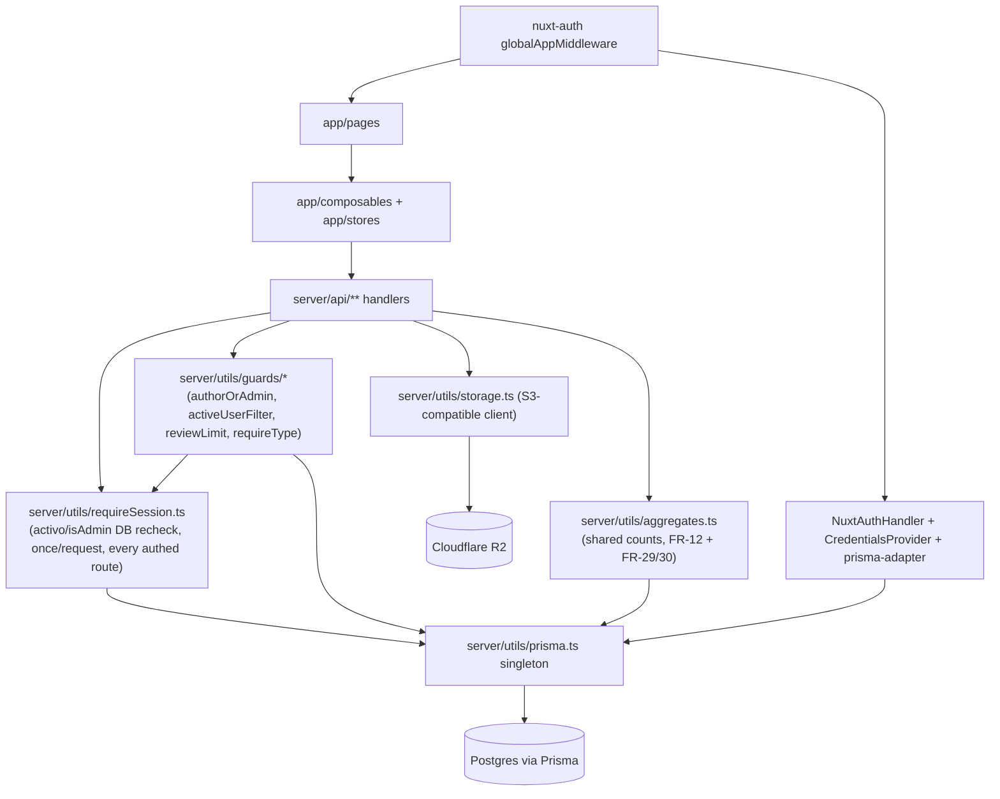
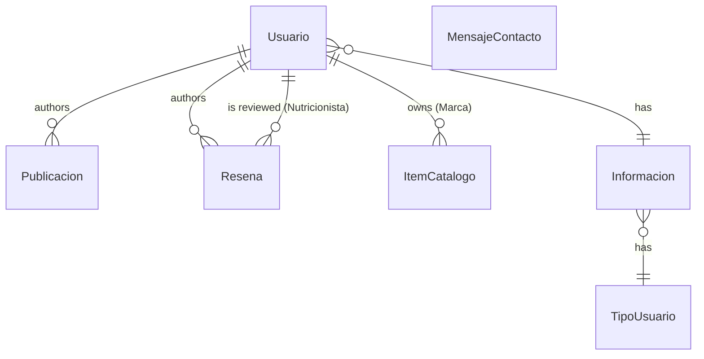

# Architecture Spine — Elite Hub

## Design Paradigm

**Transaction Script + shared Authorization Guards.** Route handlers are thin scripts over Prisma — no service/repository/controller layer. Cross-cutting rules the PRD introduces (author-or-admin, active-user filtering, review-limit, type-gating) live once as shared guard functions, not reimplemented per handler.

- `server/api/**` — one Transaction Script per HTTP-method file (`.get/.post/.put/.delete.ts`), calls `prisma.*` directly.
- `server/utils/**` — shared guards, the Prisma singleton, the storage client. The only place cross-cutting logic is allowed to live server-side.
- `app/**` — Nuxt frontend: `app/pages` (views), `app/composables` + `app/stores` (client state, client-side-fetch-after-mount pattern, no SSR data fetching). Global auth gating via `@sidebase/nuxt-auth`'s `globalAppMiddleware`.
- Auth stack is layered, not redundant: `@sidebase/nuxt-auth` (Nuxt module wrapping route gating) → `next-auth` v4 `NuxtAuthHandler` + `CredentialsProvider` (email+bcrypt) → `@next-auth/prisma-adapter` → Prisma singleton. All three packages load-bearing; not audited/reduced in this MVP (PRD §8 non-goal).

## Invariants & Rules



### AD-1 — Transaction Script + Authorization Guards

- **Binds:** all `server/api/**` handlers; FR-14, FR-18, FR-20, FR-24, FR-26, FR-28, FR-36, FR-37, FR-40, FR-43
- **Prevents:** a service/repository/controller layer fragmenting where business rules live; the same cross-cutting rule (e.g. author-or-admin) being reimplemented differently in independently-built handlers
- **Rule:** Route handlers under `server/api/**` stay thin Transaction Scripts calling `prisma.*` directly — no intermediate layer. **[ADOPTED]** (current reality, ratified). Every new cross-cutting rule the PRD introduces — author-or-admin, active-user filter, review-limit, type-gating — is implemented exactly once as a shared guard function in `server/utils/`, imported wherever needed, never reimplemented inline per handler. **[NEW]** `authorOrAdmin` takes an explicit `action: 'edit' | 'delete'` parameter — `authorOrAdmin(resource, action, session)` — never a bare boolean, since admin rights differ by action per resource (matrix below). **[NEW]**

**Action → role matrix (per resource):**

| Resource | Author edit | Author delete | Admin edit | Admin delete/act |
| --- | --- | --- | --- | --- |
| Eventos/Noticias (FR-14) | yes | yes | yes | yes |
| Ítems de Catálogo (FR-43) | yes | yes | yes | yes |
| Publicaciones (FR-28) | yes | yes | **no** (admin cannot edit another user's Publicación) | yes (delete only) |
| Reseñas (FR-36) | **no** (no self-edit) | n/a | no | **retract** only — a distinct action from edit/delete |

### AD-2 — Storage: Cloudflare R2

- **Binds:** FR-35, and every upload path (profile photos, catalog item images, publicación images, content images)
- **Prevents:** local-disk storage persisting past FR-35, or different upload endpoints growing divergent storage implementations; single-string vs. array divergence between resources' image fields
- **Rule:** All file uploads go through a single storage client (`server/utils/storage.ts`) targeting Cloudflare R2 via an S3-compatible SDK (e.g. `@aws-sdk/client-s3`). No handler uses Nitro's `useStorage('public')` fs driver or writes to local disk directly. The client's upload function always returns `Promise<string[]>` — an array, even for single-image cases (e.g. profile photo) — so every resource's image field is uniformly an array at the Prisma layer. **[NEW]**
- **Caveat:** `@aws-sdk/client-s3` has known friction on Cloudflare Workers/Pages runtimes (filesystem-dependent config loader, bundle-size inflation) — relevant only if the still-deferred hosting decision (see Deferred) lands on a Workers-based platform; harmless otherwise, not a blocker.

### AD-3 — Charting: vue-chartjs

- **Binds:** FR-29, FR-30 (and any Reportes/Indicadores metric added post-MVP)
- **Prevents:** a second charting library entering the stack for later Reportes work; an unplanned Nuxt UI v3 dependency (Nuxt Charts' actual styling dependency in practice, not bare Tailwind — superseded by this AD)
- **Rule:** All chart rendering uses `vue-chartjs` (a Chart.js wrapper for Vue) + `chart.js`. No other new dependency is required beyond these two packages. No alternate charting library is introduced.

### AD-4 — Auth freshness: DB-recheck on every request

- **Binds:** FR-36 (admin block must take effect immediately), FR-40 (deactivation hiding), all authenticated endpoints
- **Prevents:** stale-JWT authorization bugs; the existing two-pattern inconsistency (JWT-trust-only vs DB-recheck) persisting; routes that touch none of the four business guards (e.g. "view my own profile") silently skipping the recheck
- **Rule:** A dedicated primitive — `requireSession()` (`server/utils/requireSession.ts`; called first in every authenticated handler, or a Nitro server middleware) — performs the `Usuario.activo`/`Usuario.isAdmin` DB recheck exactly ONCE per request. JWT claims alone are never trusted for these two fields. The four business guards (`authorOrAdmin`, `activeUserFilter`, `requireType`, `reviewLimit`) consume `requireSession()`'s output rather than each re-querying. `requireSession()` fires on **every** authenticated route, not only routes that also need a business guard. **[NEW]**

### AD-5 — Deactivation cascade: shared active-user filter

- **Binds:** FR-40
- **Prevents:** a list/feed/catalog/directory endpoint leaking a deactivated user's content because the filter was hand-rolled and missed; no route existing anywhere for admin to find/reactivate a deactivated Usuario; ambiguity on which Usuario relation a filter targets for models with more than one
- **Rule:** Every endpoint returning a collection of user-authored content (directories, home feed, catálogo, eventos/noticias listing) applies a shared `activeUserFilter()` Prisma where-helper from `server/utils/`. No handler inlines its own `activo` filter. `activeUserFilter()` takes two parameters: **[NEW]**
  - a relation/field name, required — e.g. `activeUserFilter('autor')` — since `Resena` has two Usuario relations (`autor`, `nutricionista`) and the filter must specify which it targets;
  - an explicit admin-bypass flag — e.g. `activeUserFilter('autor', { bypassForAdmin: true })` — so FR-18's admin profile-edit surface and any admin moderation/recovery surface (UJ-5, FR-36) can find and act on deactivated Usuarios. Without this, no route in the spine could ever let admin reactivate someone.
- **Note — Reseñas are NOT in the FR-40 cascade for MVP:** matching the PRD's own already-recorded deferral (prd.md §11: "a deactivated Usuario's Reseñas staying visible"), Reseñas are excluded — a deactivated/blocked Usuario's authored Reseñas remain visible. This is not a new architecture-level gap; do not expand scope to cover Reseñas here.

### AD-6 — Frontend guards: middleware + shared composable

- **Binds:** admin-only pages; author-or-admin UI checks across Eventos/Noticias, Publicaciones, Reseñas, Ítems de Catálogo
- **Prevents:** the existing pattern of `authStore.user?.isAdmin` copy-pasted ad hoc across ~10 page components continuing to spread; one boolean composable being forced to express three genuinely different permission shapes (Eventos/Catálogo uniform, Publicaciones author-edit/either-delete, Reseñas no-self-edit/admin-retract-only)
- **Rule:** Admin-only page access is gated by `app/middleware/admin.ts` (Nuxt route middleware, auto-redirect). Author-or-admin UI checks use one shared composable — `useResourcePermissions(resource, resourceType)` returning `{ canEdit, canDelete, canRetract }` — governed by the same action→role matrix as AD-1, not inline `authStore.user?.isAdmin` checks duplicated per component. **[CHANGED from `useCanEdit(resource)`]**

### AD-7 — Single E2E suite: Playwright, ongoing parallel track

- **Binds:** PRD §9.3 Testing Track
- **Prevents:** two parallel E2E suites (Python/pytest and Playwright) both being maintained; treating E2E work as a one-off migration task instead of a standing commitment
- **Rule:** `e2e/test/`'s Playwright project is the sole E2E suite, wired into the root pnpm workspace with `webServer` + `baseURL` configured in `playwright.config.ts`. The Python/pytest suite (files + venv) is retired entirely as part of MVP work. Per PRD §9.3, this is a real, tracked effort that runs continuously alongside Must/Should feature work for the whole MVP window (through 2026-08-22) — not gating any individual FR's delivery, but not a one-time setup task either; new specs are expected to accompany new features as they land, not batched at the end.

### AD-8 — Type immutability: `Usuario.tipoUsuarioId` locked after account creation

- **Binds:** FR-3 (PRD's own highest-priority fix); FR-18 (admin profile-override surface); §5.1 registration, §5.6 profile-edit
- **Prevents:** any write path — self-service or admin — changing a Usuario's type after registration; closes an EXISTING BUG (below)
- **Rule:** `Usuario.tipoUsuarioId` — reached via `Usuario → Informacion → TipoUsuario` (**not** a direct `Usuario → TipoUsuario` relation; the schema has no such edge — see corrected ER diagram below) — is immutable after account creation. No write path, including the admin profile-override surface (FR-18), may change it once set. **[NEW]**
- **Existing bug this closes:** `server/api/profile/index.put.ts` currently allows changing `tipoUsuarioId` via profile edit. Confirmed in the file: lines 93-100 parse `informacion.tipoUsuarioId` straight from the request body into an int, with no ownership/immutability guard; lines 116-129 then spread the whole `informacion` object — `tipoUsuarioId` included — into `prisma.informacion.update()`. Since `Usuario.informacionId → Informacion.tipoUsuarioId → TipoUsuario` is the real (indirect) type path, this silently changes the Usuario's effective type today. This handler must be fixed to strip `tipoUsuarioId`/`informacion.tipoUsuarioId` from its write payload entirely.

## Consistency Conventions

| Concern | Convention |
| --- | --- |
| Prisma client | Every handler uses the `server/utils/prisma.ts` singleton; no handler instantiates its own `PrismaClient` — fixes `server/api/content/[page].get.ts` and `.put.ts` |
| Error shape | `createError({ statusCode, message })` — `message` is the canonical field; `statusMessage` usage is not introduced further |
| Package manager | pnpm only (`packageManager` pin); no `package-lock.json` in the repo |
| Upload filenames | `{resource}-{id}-{timestamp}{ext}`, extension allowlist shared from `server/utils/`; no filename pattern that risks silent overwrite |
| Upload/insert ordering | For create flows with an attached image: insert the DB row first with a null/placeholder image field, then upload, then patch the row with the resulting URL(s) — cheapest failure mode to detect (vs. an orphaned R2 object if insert fails after upload) |
| New Prisma model naming | Spanish PascalCase, matching `Usuario`/`Noticia`/`Evento` — applies to `Publicacion`, `Resena`, `ItemCatalogo`, `MensajeContacto`. Extends to relation field names: the canonical relation name for "the Usuario that authored/owns this row" is always `autor` (`Publicacion.autor`, `ItemCatalogo.autor` — even though conceptually "owned by a Marca," keep `autor` so `activeUserFilter('autor')` stays genuinely generic). `Resena` is the sole exception, with two explicitly-named relations: `autor` and `nutricionista` |
| Fixed-value lists | All fixed-value lists (deporte, género, país, catálogo categories — FR-19, FR-38) are defined once in a single shared source (e.g. `shared/constants/` or `server/utils/constants.ts`, accessible client + server), never hardcoded per-component. **Known pre-existing drift:** `app/pages/deportistas.vue` already hardcodes its own sport list, diverging from FR-19's canonical list — reconcile against this convention when that page is next touched |
| Theme persistence (FR-31) | Persists via `localStorage` only — client-device-scoped, NOT a Usuario/Informacion DB field. Avoids a client/server dual-source-of-truth bug |
| Field visibility (FR-17, §6/§7) | Confirmed PRD decision, not this spine's invention: full profile field set (incl. health-adjacent fields — lesiones, peso, altura) is visible to any authenticated viewer on a detail view. No per-field privacy control exists in MVP — do not add one speculatively |
| Directory pagination | Infinite scroll (FR-16) uses cursor-based pagination, 20 records per batch — one fixed default for every directory/feed/catálogo listing, not a per-endpoint choice |
| `AUTH_SECRET` | Fails fast at startup if unset; no insecure inline fallback value |
| `next-auth` version ceiling | Must stay `<4.23.0` per `@sidebase/nuxt-auth` compatibility (nuxt-auth breaks on next-auth 4.22+'s package-export changes) — do not casually bump |

## Stack

| Name | Version | Status |
| --- | --- | --- |
| Nuxt | ^4.0.0 | existing |
| Vue | ^3.5.17 | existing |
| Prisma | ^6.12.0 | existing |
| TypeScript | ^5.8.3 (strict) | existing |
| Tailwind CSS | 4 | existing |
| Pinia | ^3.0.3 | existing |
| pnpm | 10.13.1 (packageManager pin) | existing |
| Cloudflare R2 (via S3-compatible SDK, e.g. `@aws-sdk/client-s3`) | — | newly added (AD-2) |
| vue-chartjs + chart.js | — | newly added (AD-3) |

Both AD-2 and AD-3 picks satisfy PRD §7's Cost guardrail (no paid infrastructure assumed): R2's free tier and vue-chartjs/chart.js are both free/open-source, zero ongoing cost at MVP scale.

## Structural Seed

```text
server/
  api/
    publicaciones/         # NEW -- FR-26..28
    resenas/                # NEW -- FR-24, FR-36, FR-37
    catalogo/                # NEW -- FR-20..23, FR-39, FR-43 (ItemCatalogo)
    mensajes-contacto/        # NEW -- FR-10, FR-41 (MensajeContacto)
    content/[page].get.ts       # existing -- fix: use prisma singleton
    content/[page].put.ts       # existing -- fix: use prisma singleton
  utils/
    prisma.ts                    # existing singleton -- canonical for all handlers
    requireSession.ts              # NEW -- activo/isAdmin DB recheck, once per request, every authed route (AD-4)
    guards/                       # NEW -- authorOrAdmin, activeUserFilter, requireType, reviewLimit (AD-1, AD-5); consume requireSession() output
    storage.ts                     # NEW -- R2 client wrapper (AD-2), replaces useStorage('public'); returns Promise<string[]>
    aggregates.ts                   # NEW -- shared count queries for FR-12 + FR-29/30 (SM-4), deactivated Usuarios excluded
app/
  middleware/
    admin.ts                       # NEW (AD-6) -- route guard for admin-only pages
  composables/
    useResourcePermissions.ts       # NEW (AD-6) -- { canEdit, canDelete, canRetract } per resource type
prisma/
  schema.prisma                      # + Publicacion, Resena, ItemCatalogo, MensajeContacto (Spanish PascalCase convention)
```

**Deployment/environment gap:** no hosting platform is decided (open question, user-deferred — see Deferred below); no Dockerfile, docker-compose, platform config, or CI exists today. `AUTH_SECRET`'s insecure inline fallback (AD via Consistency Conventions) must be closed regardless of hosting choice.

**Core entities (new, names + relationships only):**



`MensajeContacto` has no FK to `Usuario` — anonymous public submissions (FR-10). `Resena` carries a uniqueness constraint on (author, Nutricionista) per FR-37. `Usuario → Informacion → TipoUsuario` (both hops optional/nullable in the schema, no direct `Usuario → TipoUsuario` edge) is the real type path — immutability is enforced at AD-8, not by this diagram.

## Capability → Architecture Map

| PRD Feature | Lives in | Governed by |
| --- | --- | --- |
| §5.1 Registration & Onboarding | `app/pages` (registration forms) + `server/api` create handler | AD-1, AD-8 (type set once, then immutable); new-model naming convention |
| §5.2 Content Editor Fix & Static Page Editing | `app/components/ContentEditor` + `server/api/content/**` | AD-1; Prisma singleton convention |
| §5.3 Contact Form Persistence | `app/pages/contactUs.vue` + `server/api/mensajes-contacto/**` (NEW) | AD-1; new-model naming convention |
| §5.4 Homepage Real-Time Stats | `app/pages/index.vue` stats + `server/utils/aggregates.ts` | AD-1; `aggregates.ts` shared with §5.11 (FR-12/FR-29), deactivated Usuarios excluded (SM-4) |
| §5.5 Open Eventos/Noticias Creation | `server/api/eventos/**`, `server/api/noticias/**` | AD-1 (authorOrAdmin guard) |
| §5.6 Per-Type Directory & Profile | `app/pages` (directorios, perfil) + `server/api/usuarios/**` | AD-1, AD-4, AD-5, AD-8 (type immutability incl. FR-18 admin override) |
| §5.7 Deportista Sport Filters | `app/pages/deportistas.vue` + directory query | AD-1; existing fixed-list pattern |
| §5.8 Marca Product/Service Catalog | `server/api/catalogo/**` (NEW) + `app/pages` catalogo views | AD-1 (type-gating guard), AD-5 |
| §5.9 Nutricionista Ratings & Reviews | `server/api/resenas/**` (NEW) | AD-1 (review-limit guard), AD-4 |
| §5.10 Publicaciones / Home Feed | `server/api/publicaciones/**` (NEW) + `app/pages/index.vue` feed | AD-1, AD-5 |
| §5.11 Reportes/Indicadores | `app/pages` admin reportes view + `server/utils/aggregates.ts` | AD-3; `aggregates.ts` shared with §5.4 (SM-4). PRD calls this view to a higher visual bar ("muy agradable de ver") than the rest of admin — AD-3's chart pick and any layout work here should meet that bar specifically |
| §5.12 Settings & Theme Toggle | `app/pages/settings` | Theme persistence Consistency Convention (`localStorage` only, FR-31) |
| §5.13 Visual/UI Overhaul (FR-33, FR-34) | cross-cutting `app/**` components/pages | In-scope Should-tier work, not deferred. Consistency: FR-34 responsiveness preserved is a hard constraint on every surface touched. FR-33's sitewide hover micro-interaction has no shared component/utility named — that specific gap (not the FR itself) is in Deferred as opportunistic |
| §5.14 File Storage Migration | `server/utils/storage.ts` + all upload handlers | AD-2 |

## Deferred

- **Hosting/deployment platform** — explicitly deferred by the user during coaching (memlog `(question)`); revisit before or during the FR-35 storage-migration work since hosting choice may shape env/config.
- **Full Prisma schema for new models** (`Publicacion`, `Resena`, `ItemCatalogo`, `MensajeContacto`) — full attribute lists are seed owned by the code once written, not this spine; naming convention is the only invariant fixed here.
- **Exact env-var/secrets management approach** — beyond "`AUTH_SECRET` fails fast if unset," no broader secrets-management strategy is decided.
- **CI/CD pipeline** — explicit PRD non-goal for this MVP (§8).
- **The lower-priority edge-case findings** surfaced during PRD discovery (last-admin deactivation guard, admin promotion path, deactivated user's Reseñas staying visible [now explicit under AD-5], retracted-Reseña slot not freeing up, no self-service Reseña edit, no self-review exclusion, etc.) — see `prd.md` §11; consciously deferred by the user, worth a pass if any prove cheap to close during epic/story breakdown.
- **RBAC (`Rol`/`Permiso`) activation** — explicit PRD non-goal (§8); flat `isAdmin` boolean plus author-or-admin guards (AD-1) remain the sole authorization model for MVP.
- **Lower-severity consistency gaps identified during adversarial review** (multi-field validation error payload shape, shared hover-interaction utility, E2E fixture/seed conventions, type-gate enforcement on non-creation write paths) — see `reviews/review-adversarial.md` holes #10, #12, #13, #14 — worth closing opportunistically during epic/story work, not blocking.
